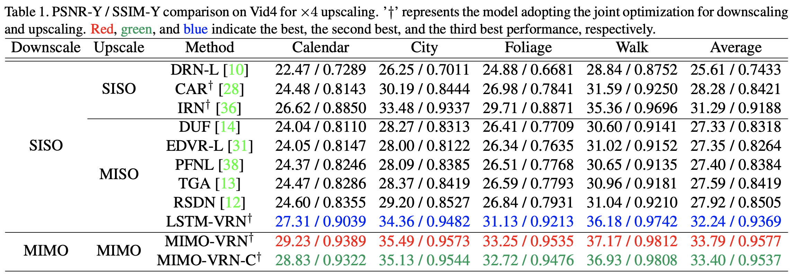
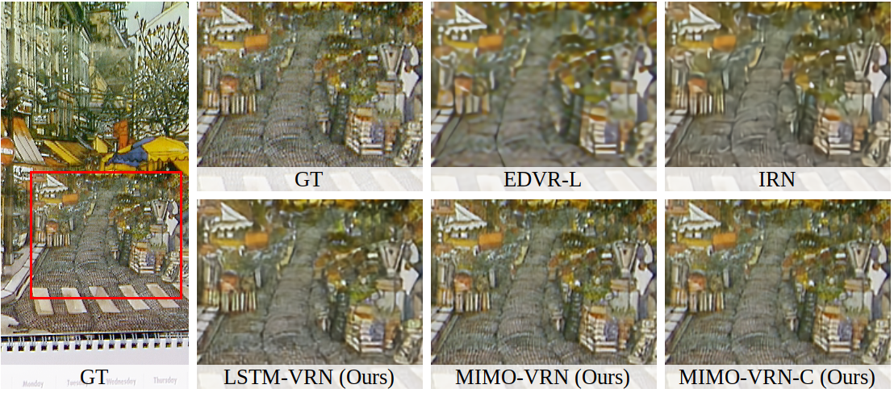
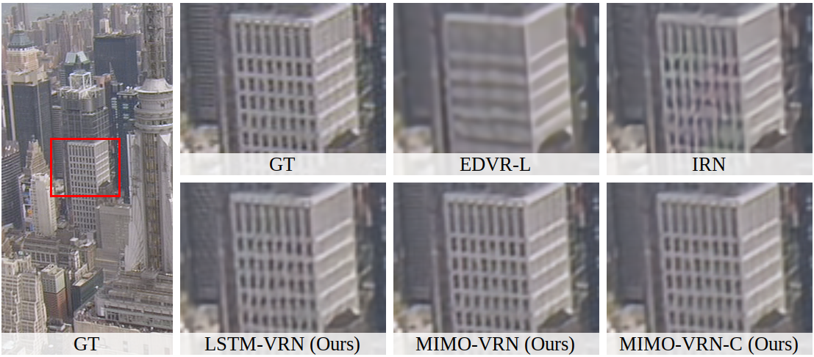
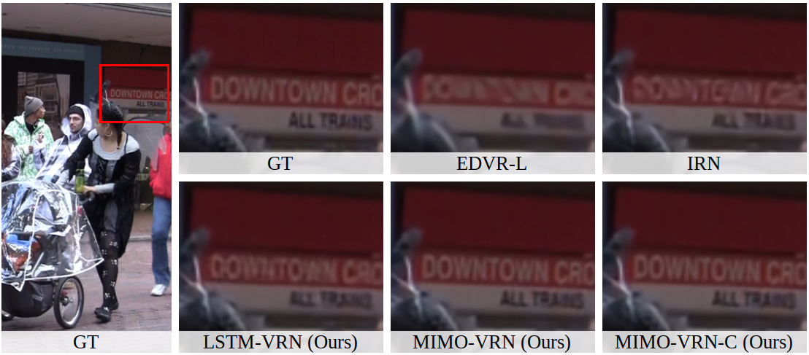
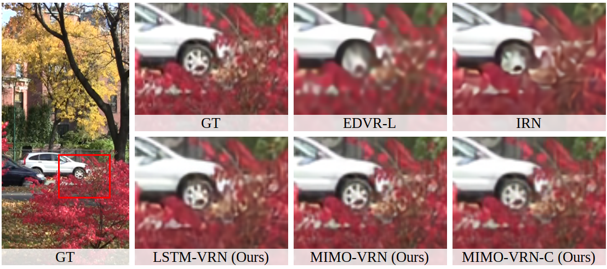
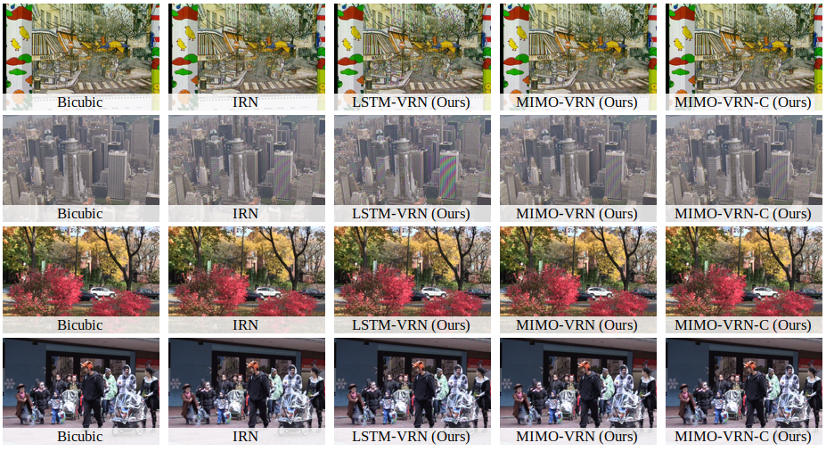

# Video Rescaling Networks with Joint Optimization Strategies for Downscaling and Upscaling (CVPR 2021)
Pytorch Implementation of the paper "Video Rescaling Networks with Joint Optimization Strategies for Downscaling and Upscaling (CVPR 2021)".

Project Page: [Link](https://ding3820.github.io/MIMO-VRN/)

Paper: [Link](https://ding3820.github.io/MIMO-VRN/)


## Prerequisite
- Python 3 via Anaconda (recommended)
- PyTorch >= 1.4.0
- NVIDIA GPU + CUDA
- Python Package: `pip install numpy opencv-python lmdb pyyaml`

## Dataset Preparation
Training and testing dataset can be found [here](https://github.com/xinntao/BasicSR/blob/master/docs/DatasetPreparation.md#LMDB-Description). 
We adopt the LMDB format and also provide the script in `codes/data_scripts`. 
For more detail, please refer to [BasicSR](https://github.com/xinntao/BasicSR).

## Usage
Pretrained weight can be downloaded from [Google Drive](https://drive.google.com/drive/folders/1hlQ8nHSJysqZ6h5vyPz-HApyTD_an7Xb?usp=sharing).

All the implementation are in `/codes`. To run the code, 
select the corresponding configuration file in `/codes/options/` and run as follow (MIMO-VRN for example):
#### Training
```
python train.py -opt options/train/train_MIMO-VRN.yml
```
#### Testing
```
python test.py -opt options/test/test_MIMO-VRN.yml
```

## Quantitative Results 
#### HR Reconstruction on Vid4


## Qualitative Results
#### HR Reconstruction on Vid4





#### LR Reconstruction on Vid4



## Citation
```
```
## Acknowledgement
Our project is heavily based on [Invertible-Image-Rescaling](https://github.com/pkuxmq/Invertible-Image-Rescaling) and they adopt [BasicSR](https://github.com/xinntao/BasicSR) as basic framework.